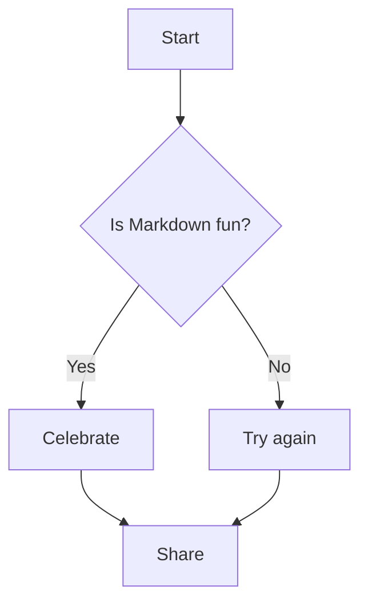

# H1 — Header level 1

## H2 — Header level 2

### H3 — Header level 3

#### H4 — Header level 4

##### H5 — Header level 5

###### H6 — Header level 6

---

## Emphasis

This is *italic* text.

This is **bold** text.

This is ***bold italic*** text.

This is ~~strikethrough~~ text.

This is <u>underlined</u> (HTML — not standard Markdown).

Inline code: `const x = 42` and multiple inline `code spans`.

Keyboard keys: `Ctrl` + `C` or <kbd>Ctrl</kbd> + <kbd>C</kbd> (HTML).


## Blockquotes

> This is a simple blockquote.
>
> > Nested blockquote.
>
> Blockquotes can contain other elements like lists or code:
>
> - item in a quoted list
> - another item
>
> ```js
> // code inside a quoted fenced block
> console.log('hello from a quote');
> ```


## Lists

### Unordered list

- Bullet 1
  - Sub-bullet A
    - Sub-sub-bullet i
- Bullet 2

### Ordered list

1. First
2. Second
   1. Second → sub 1
   2. Second → sub 2
3. Third

### Task list (GFM)

- [x] Completed task
- [ ] Incomplete task
- [ ] Another task


## Tables

| Left-aligned | Centered | Right-aligned |
|:-------------|:--------:|--------------:|
| row 1 col 1  |   row 1  |         123.4 |
| row 2 col 1  |   row 2  |         56.0  |


## Links and references

Regular link: [OpenAI](https://openai.com)

Reference-style link: [example][ref-link]

[ref-link]: https://example.com "Example Domain"

Autolink: <https://example.com>

Email autolink: <user@example.com>


## Images

Inline image (remote):


Reference-style image:

![Logo][logo]

[logo]: https://via.placeholder.com/150 "Placeholder Logo"


## Code blocks

Fenced code block (no language):

```
This is a plain code block.
Multiple lines are supported.
```

Fenced code block (with language for syntax highlighting):

```python
# example python code
def greet(name):
    return f"Hello, {name}!"

print(greet('world'))
```

Inline code and long code sample above.


## Math (LaTeX)

Inline math: $e^{i\pi} + 1 = 0$.

Display math:

$$
\int_{-\infty}^{\infty} e^{-x^2} \, dx = \sqrt{\pi}
$$

(Requires a renderer that supports LaTeX — e.g., MathJax or KaTeX.)


## HTML blocks

You can insert raw HTML:

<div style="padding:8px;border:1px solid #ddd;border-radius:6px;">
**This is an HTML block** inside the Markdown file.
</div>


## Horizontal rules

---

***

___


## Definition list (Markdown extension / HTML fallback)

Term 1
:   Definition 1. This uses the definition list style supported by some Markdown parsers.

Term 2
:   Definition 2.

(If your renderer doesn't support definition lists, use a simple heading + paragraph.)


## Abbreviations (some renderers)

The HTML for <abbr title="HyperText Markup Language">HTML</abbr> is widely supported.


## Footnotes (GFM / some renderers)

Here's a sentence with a footnote.[^1]

[^1]: This is the footnote text. It can contain **formatting** and `code`.


## Emoji

Smiley: :smile: — rendered as an emoji on supporting platforms.


## Mention and tags (GitHub-like)

Mention: @username — may/not render depending on platform.

Issue reference: #1234


## Checklist of extended features

- [x] Headings
- [x] Emphasis
- [x] Lists
- [x] Code (inline + fenced)
- [x] Tables
- [x] Images + Links
- [x] Math blocks
- [x] HTML blocks
- [x] Footnotes
- [ ] Mermaid diagrams (below)


## Mermaid (graph/diagram) — if supported by renderer




## Admonition / Callout example (non-standard)

> **Note:** This is a callout box. Some renderers support special syntax like `> [!NOTE]` to style admonitions.


## Anchors and internal links

- [Jump to Tables](#tables)
- [Jump to Code blocks](#code-blocks)


## Printable checklist

1. Verify headings
2. Verify lists
3. Verify code highlighting
4. Save as `.md` file


## Copyright / License

> © 2025 — Generated content. You may copy, modify, and use this file for testing.


## End of file

<!-- HTML comment: this comment will not appear in rendered output -->

